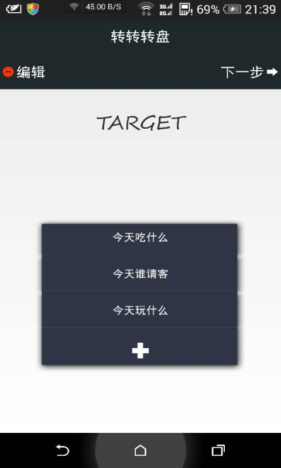
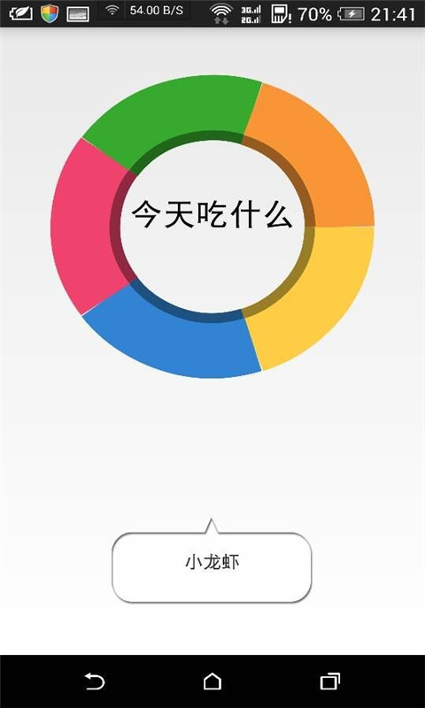

# ZZZP (转转转盘)

ZhuanZhuanZhuanPan AKA ZZZP (转转转盘) is an Android application where you can use a "wheel of fortune" to make a decision. For instance, you can type in names several different restaurants if you are not sure which one to choose for a lunch. Manually slide the screen to make the wheel run. Also, your options will be saved for your next use.

# How it works ？
### Main Menu

### Wheel of Fortune

### Options

### Spin

### Result

# Download
Check [release](https://github.com/louisvitamin/ZZZP/releases)    
You may also find it on [腾讯应用宝](http://sj.qq.com/myapp/detail.htm?apkName=com.example.zhuanzhuanzhuanpan) and other Android app stores. 

# Todos
Unfortunately, zzzp is only available on Android right now. We are working on the vesion for WeChat WeApp.

License
----

MIT
